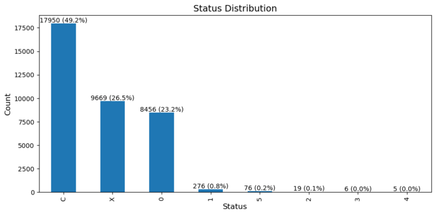

## REVOLUTIONIZING CREDIT CARD APPROVAL WITH METRIC MARVINS

Metric Marvins stands out as the premier credit analyst, leveraging the prowess of historical data and advanced machine learning techniques. Our state-of-the-art model excels in accurately predicting creditworthiness, adapting seamlessly to economic fluctuations, and outperforming traditional scoring methods.

# Business Understanding
# 1.1 Project Overview

Credit score cards are widely used in the financial industry to evaluate the risk of issuing credit cards. Traditional methods can be affected by economic fluctuations, prompting the use of machine learning algorithms. While these improve accuracy, they often lack transparency in explaining acceptance or rejection decisions to customers and regulators. This Project aims to improve transparency in the whole process quantifying the reasons why one is approved or denied a credit card

# 1.2 Problem Statement

Existing credit scoring methods based on historical data and traditional financial metrics face limitations in predicting creditworthiness accurately due to economic fluctuations. There is a need to develop a credit scoring model that leverages historical data and advanced machine learning techniques for better prediction while providing transparent results for customers and regulators. The goal is to create a reliable and transparent credit scoring system that informs decision-making and ensures fair treatment of applicants.

The end user is the bank that will use this deployment in conjunction with their own to complement the credit scoring system

# 1.3 Project Objectives

1. Develop a credit scoring model that incorporates personal and social factors and machine learning algorithms to enhance the accuracy of creditworthiness predictions.
2. Improve transparency in credit scoring by utilizing interpretable machine learning techniques, allowing for clear explanations of acceptance or rejection decisions to customers and regulatory bodies.
3. Mitigate the impact of economic fluctuations on credit scoring models by incorporating dynamic factors and adapting the model to changing economic conditions.
4. Optimize the balance between prediction accuracy and interpretability to ensure a fair and reliable credit scoring system for both applicants and financial institutions.

# 1.4 Success Metrics.

We set a ``specific target for our credit card approval prediction model``, aiming to achieve a ``recall score of 80%``. This means our focus is on maximizing the identification of approved credit card applications, minimizing the chances of false negatives and ensuring a high level of accuracy in predicting positive outcomes.

# 2. Data Understanding

For this project, we utilized a dataset  sourced from [Kaggle](https://www.kaggle.com/datasets/rikdifos/credit-card-approval-prediction).There are two datasets,the Applications Dataset and the Credits Dataset. The Applications dataset has 438557 rows and 18 columns. The Credits dataset has 1048575 rows and 3 columns.
The features encompass social and economic factors that have an impact on the credit card application status of individual applicants

The data for this project was sourced from Kaggle . This data consists of information of past application and credits

# 2.1 Applications Dataset

Feature name 	Explanation

ID 	Client number

CODE_GENDER 	Gender

FLAG_OWN_CAR 	Is there a car

FLAG_OWN_REALTY 	Is there a property

CNT_CHILDREN 	Number of children

AMT_INCOME_TOTAL 	Annual income

NAME_INCOME_TYPE 	Income category

NAME_EDUCATION_TYPE 	Education level

NAME_FAMILY_STATUS 	Marital status

NAME_HOUSING_TYPE 	Way of living

DAYS_BIRTH 	Birthday

DAYS_EMPLOYED 	Start date of employment

FLAG_MOBIL 	Is there a mobile phone

FLAG_WORK_PHONE 	Is there a work phone

FLAG_PHONE 	Is there a phone

FLAG_EMAIL 	Is there an email

OCCUPATION_TYPE 	Occupation

CNT_FAM_MEMBERS 	Family size

Note -

DAYS_BIRTH ---> Count backwards from current day (0), -1 means yesterday

DAYS_EMPLOYED ---> Count backwards from current day(0). If positive, it means the person currently unemployed.

# 2.2 Credits Dataset
Feature name 	Explanation

ID 	Client number

MONTHS_BALANCE 	Record month

STATUS 	Status

Note -

MONTHS_BALANCE ---> The month of the extracted data is the starting point, backwards, 0 is the current month, -1 is the previous month, and so on.

STATUS ---> 0: 1-29 days past due 1: 30-59 days past due 2: 60-89 days overdue 3: 90-119 days overdue 4: 120-149 days overdue 5: Overdue or bad debts, write-offs for more than 150 days C: paid off that month X: No loan for the month

## 2.1Data Preprocessing
 During our thorough analysis of the raw data, we discovered missing values specifically in the occupation variable. To address this, we performed imputation techniques to fill in the missing values. Additionally, we conducted outlier detection to identify and handle any extreme values present in the dataset.

 Furthermore, we addressed duplicated entries by removing them to ensure data integrity. To enhance clarity and consistency, we renamed variables appropriately. In order to establish uniformity, we converted certain variables to a yearly basis. Additionally, we adjusted the data types of variables as needed to ensure accurate and efficient analysis.

## 2.2 Data Analysis (EDA)

 We conducted an in-depth analysis of the dataset to uncover patterns, trends, and insights. This included analyzing the Status of the clients based their previous loan payments.

C - indicates that the client has paid off the loan in full for that particular month.
X- suggests that the client did not have any loan obligations for that specific month
Overdue ,write offs- indicating bad debts or write-offs that have been pending for more than 150 days.
The others indicates the  client's payment is overdue by certain  number of days

# 3. Modeling

We opted for the Decision Tree Classifier as our final model. This choice was driven by its interpretability, which enables us to gain insights into the decision-making process and provide transparent explanations for credit card application outcomes.

### The model results:

- Training Accuracy: 0.870
- Testing Accuracy: 0.789
- Recall Score: 0.85

# 6. Conclusion.

* After the models were evaluated, the Decision Tree model was selected as the final model based on high performance on evaluation metrics. Training Accuracy: 0.870 Testing Accuracy: 0.789 Recall Score: 0.85 were achieved by the final model, indicating its ability to classify approval or denial status with high accuracy and low false positives and false negatives.

* The dataset was highly imbalanced, with a small percentage of denial status, with the majority being approved on their credit card application.

* Traditional credit scoring methods based on financial metrics have limitations in accurately predicting creditworthiness, especially during economic fluctuations. Machine learning algorithms, when applied to credit scoring, have shown promise in enhancing prediction accuracy.

* It was observed that the most common status is "C" (likely_good_debtor), followed by "X" (likely_good_debtor) and "0" (Neutral_Debtor). Features such as income type, property ownership, gender, and family status showed relationships with the credit approval status.

* Based on the bank's risk appetite, debtors can be categorized as "Approved" (likely_good_debtor, Neutral_Debtor) or "Denied" (likely_Bad_Debtor, likely_written_off) based on the credit approval status.

# 7. Reccomendation.

* Further explore the reasons behind different loan statuses ("C," "X," "0," etc.) to gain insights into loan approval decisions.

* Conduct additional research or collect more data to better understand the demographic and social economic factors contributing to loan approval.

* Explore the use of additional data sources, such as social media activity or online transaction history, to improve credit assessment and enhance predictive accuracy.

* Establish a process for ongoing evaluation and refinement of the credit scoring model, including regular updates and retraining based on new data and feedback.

* Conduct training and educational programs to enhance stakeholders' understanding of the credit scoring system, promoting transparency and empowering customers to make informed financial decisions.

By implementing these specific recommendations, stakeholders can enhance the accuracy, transparency, and fairness of their credit approval process, leading to improved risk assessment, customer satisfaction, and financial outcomes.

# 8. Limitations.

* The dataset used has limited number of features while there could be other factors that contribute to the credit approval status.
* The quality and availability of data can significantly impact the project. Limitations may include incomplete or missing data, data with errors or inconsistencies, biased or unrepresentative data, or limited access to relevant data sources.
* The evolving nature of data science introduces the risk of project outcomes becoming outdated as new methods, techniques, and data sources emerge.
* Different algorithms have inherent limitations, such as assumptions about data distribution, sensitivity to outliers, or constraints on features or samples, which can impact the accuracy and effectiveness of the results.

# 9. Next steps.
* New features can be generated from the existing data to provide more insights.
* Explore alternative data sources or consider data augmentation techniques to enhance the quality and availability of the data.
* Consider incorporating more complex modeling techniques or exploring ensemble methods to capture nuances and avoid oversimplification.
* Regularly review and keep up-to-date with advancements in algorithms and techniques to leverage new approaches that overcome limitations.
* Regularly reassess and update models or approaches to incorporate new methods, algorithms, or data sources as they become available.

# Installations
To install and run this project, follow these steps:

Clone the repository to your local machine using the following command:
git clone https://github.com/ndungek/Credit-Card-Approval-Prediction
Navigate to the project's root directory:
cd your-repository
Install the project dependencies(For this project we worked with Jupyter notebook, however it can also run on vscode or Google collab:
This command will install all the necessary packages and libraries required for the project to run(this should br run in the terminal(for our case Anaconda).
pip install Jupyter Notebook
Call the note book in the directory
jupyter notebook
code .. for VS code
Open your web browser and access the application at http://localhost:5000. This is the default URL where the application will be running locally.
Collaborators
feel free to visit this jupyternotebook and contact below emails

Leah Katiwa: @katiwaleah26@gmail.com

Maureen Kitang'a: @ndungek66@gmail.com

Ronald Nyagaka: 

Paul Kamau: @kamaa.njuguna16@yahoo.com

Beatrice Kirui: @beatriceckirui15@gmail.com

Cliff Shitote: @cliffbrecht6@gmail.com

Repository Structure:
├── .gitignore

├── CONTRIBUTING

├── LISENCE.md

|── Phase4_project.ipynb

├── data

├── README.md

Web app link: 

Project status
The current version of the project is finished and ready for use. Improvements will be made later.
